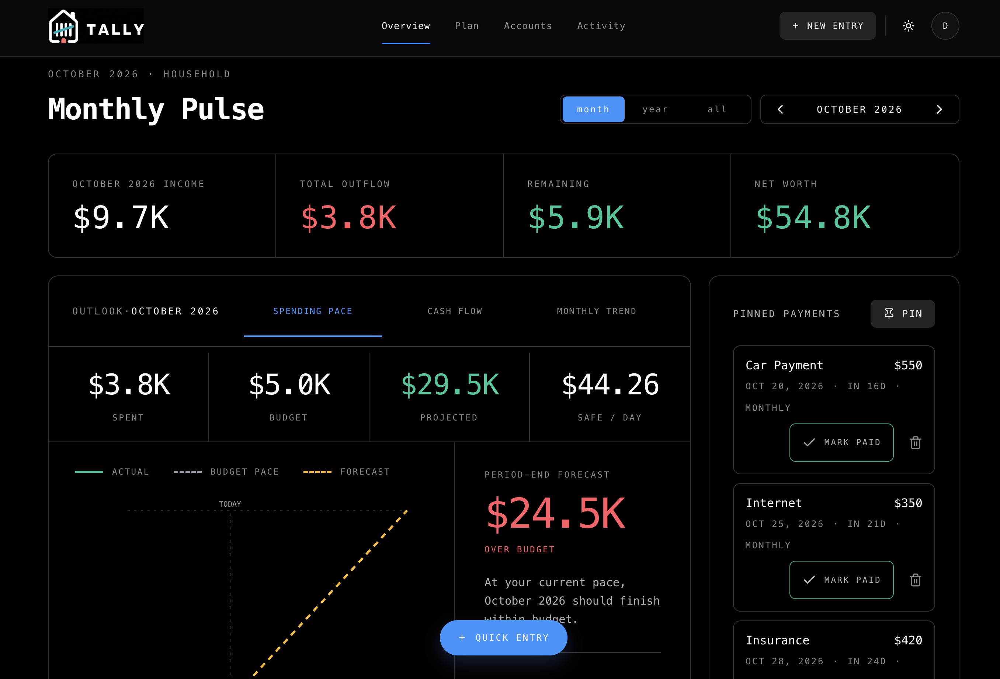
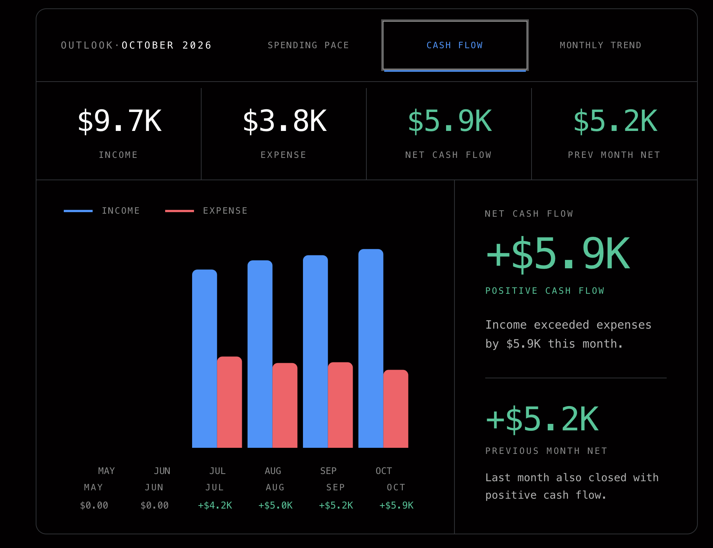
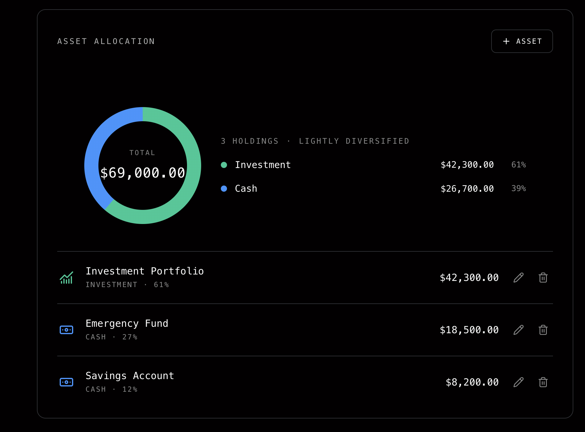
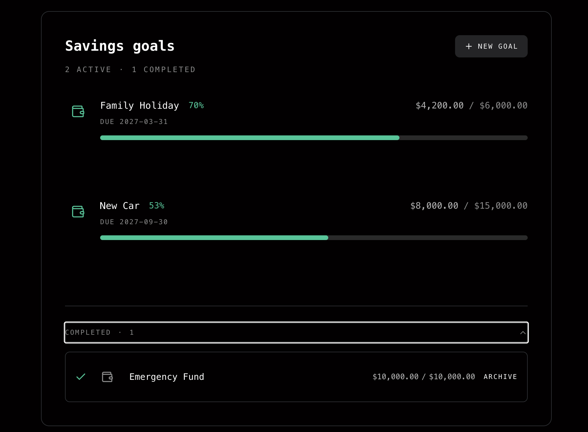

# Tally

A full-stack personal finance dashboard for understanding where your money is going and what's coming next.

Tally brings transactions, budgets, cash flow, assets, liabilities, recurring payments and savings goals into one place. I built it to demonstrate end-to-end product development: from responsive UI and data visualisation to authentication, database design and server-side functionality.

**[Live Demo →](https://budget-app-two-gules.vercel.app/)**

> No account required — select **Try Demo Account** to explore with sample data.

## Built with

Next.js · React · TypeScript · Supabase · PostgreSQL · SCSS Modules · Tailwind CSS · shadcn/ui · Recharts · Vercel · Supabase 

## Preview

## Preview

### Stay ahead of your finances

### Financial overview and forecasting

Track income, spending, remaining cash, net worth and upcoming payments from a single monthly view.

### Cash-flow insights

Compare income and expenses across months and see whether the household is maintaining positive cash flow.

### Assets and net worth

Track holdings and understand how assets are distributed across investments, cash and other categories.

### Savings goals

Create financial goals, monitor progress and keep completed goals available for reference.

## What Tally demonstrates

Tally started as a frontend-focused project and grew into a full-stack application. I designed and implemented the interface while also building the data and authentication flows that support it.

### Frontend
- Responsive interfaces with Next.js and React
- Type-safe application development with TypeScript
- Reusable component architecture
- Interactive financial charts and data visualisation
- Forms, modals, navigation and application states
- Dark/light theme support

### Backend & data
- Supabase authentication
- Anonymous demo sessions for portfolio visitors
- PostgreSQL-backed application data
- Row Level Security for user-owned data
- Server-side actions and data mutations
- Demo data seeding
- Financial data aggregation across transactions, budgets, assets and liabilities

### Product functionality
- Income and expense tracking
- Monthly, yearly and lifetime views
- Category budgets
- Cash-flow analysis and forecasting
- Pinned recurring payments
- Asset allocation
- Liability tracking
- Savings goals
- Period-specific budget notes

## Try it

The application includes a dedicated demo experience, so you can explore Tally without creating an account.

1. Open the live application.
2. Select **Try Demo Account**.
3. Tally creates an anonymous session and loads sample household financial data.
4. Explore the dashboard and features freely.

**[Launch Tally →](https://budget-app-two-gules.vercel.app/)**

